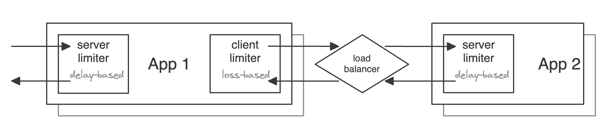

# congestion-limiter

Dynamic concurrency limits for controlling backpressure, inspired by TCP congestion control.

[![Crates.io][crates-badge]][crates-url]
[![MIT licensed][mit-badge]][mit-url]
[![Docs][docs-badge]][docs-url]

[crates-badge]: https://img.shields.io/crates/v/congestion-limiter.svg
[crates-url]: https://crates.io/crates/congestion-limiter
[mit-badge]: https://img.shields.io/badge/license-MIT-blue.svg
[mit-url]: https://opensource.org/licenses/MIT
[docs-badge]: https://img.shields.io/badge/docs-latest-blue.svg
[docs-url]: https://docs.rs/congestion-limiter

[Additional documentation](./docs/index.md)

## The problem

When a service is overwhelmed with more work than it can handle, everything degrades. Latency spikes, requests start failing, and those failures cascade through the system. Services need a way to detect this and shed excess load before it causes damage.

## Why not rate limiting?

Rate limiting — controlling the number of requests per second — is the most common defence. But it's one-dimensional: it doesn't consider how long work takes.

Think of it like a nightclub. Rate limiting is controlling how many people enter per minute. Concurrency limiting is controlling how many people are inside at once. If people start staying longer, a rate limit still lets the same number in, and the place gets dangerously overcrowded. A concurrency limit naturally adapts: if people stay longer, fewer new people are admitted.

This matters in practice. When latency increases — because of expensive requests, reduced capacity, or a downstream slowdown — a rate limit still lets the same volume of traffic through, making overload worse. A concurrency limit automatically admits fewer requests, because existing ones are taking longer to complete.

See [why concurrency limiting](./docs/why-concurrency-limiting.md) for a worked example and the full argument.

## Why dynamic?

Even with a concurrency limit, what should the number be? It depends on the system, the workload, and downstream capacity — and all of these change over time. A static limit that was right yesterday might be too low today (wasting capacity) or too high (not protecting the system).

This library discovers the right limit automatically, by observing system behaviour and adjusting.

## How it works

The library observes job latency and failure rates, and adjusts the concurrency limit using algorithms based on [TCP congestion control](https://en.wikipedia.org/wiki/TCP_congestion_control). When things are going well, the limit increases. When latency rises or failures are detected, the limit decreases. Beyond the limit, requests are rejected, providing backpressure to upstream systems.

For an intuitive walkthrough, see the [supermarket analogy](./docs/supermarket-analogy.md). For technical detail on the detection mechanisms, see [how detection works](./docs/how-detection-works.md).

## Goals

This library aims to:

1. Achieve optimally high throughput and low latency.
2. Shed load and apply backpressure in response to congestion or overload.
3. Fairly distribute available resources between independent clients with zero coordination.

## Example

```rust
use congestion_limiter::{limits::Aimd, limiter::{Limiter, Outcome}};

// Create a limiter with the AIMD algorithm.
// This can be shared between request handlers (Limiter is cheaply cloneable).
let limiter = Limiter::new(
    Aimd::new_with_initial_limit(10)
        .with_max_limit(20)
        .decrease_factor(0.9)
        .increase_by(1),
);

// A request handler
tokio_test::block_on(async move {
    // Try to acquire a token. Returns None if the limit has been reached.
    let token = limiter.try_acquire()
        .expect("No capacity available — Loss-based algorithms would see this as an overload signal");

    // Do some work...

    // Report the outcome so the algorithm can adjust the limit.
    token.set_outcome(Outcome::Success).await;
});
```

## Algorithms

The algorithms detect congestion or overload by observing two types of feedback:

- **Loss-based** — react to job failures caused by overload. Feedback can be explicit (e.g. HTTP 429 or 503) or implicit (e.g. a timeout).
- **Delay-based** — react to increases in latency, a sign of growing queues. Feedback is implicit.

| Algorithm                          | Feedback       | Response             | [Fairness](https://en.wikipedia.org/wiki/Fairness_measure)                                       |
|------------------------------------|----------------|----------------------|--------------------------------------------------------------------------------------------------|
| [AIMD](src/limits/aimd.rs)         | Loss           | AIMD                 | Fair, but can out-compete delay-based algorithms                                                 |
| [Gradient](src/limits/gradient.rs) | Delay          | AIMD                 | TODO: ?                                                                                          |
| [Vegas](src/limits/vegas.rs)       | Loss and delay | AIAD (AIMD for loss) | [Proportional](https://en.wikipedia.org/wiki/Proportional-fair_scheduling) until overload (loss) |

See [how detection works](./docs/how-detection-works.md) for more on delay-based vs loss-based detection.

### Example topology

The example below shows two applications using limiters on the client (output) and on the server (input), using different algorithms for each.



See [architecture patterns](./docs/architecture-patterns.md) for guidance on server-side vs client-side limiting.

### Caveats

- **Loss-based algorithms require a reliable signal for load-based errors.**
  - If configured to reduce concurrency for non-load-based errors, they can exacerbate availability problems when these errors occur.
- **Delay-based algorithms work more reliably with predictable latency.**
  - For example, short bursts of increased latency from GC pauses could cause an outsized reduction in concurrency limits.
  - Windowing can help with this.
- **Cold-start problem: capacity limits are not known at start up.**
  - There's a need to probe to discover this. Requests could be unnecessarily limited until the limit is increased to match capacity.
  - Can be mitigated with single immediate retries (from a token bucket?) on the client, which might get load balanced to a server with available capacity.

## FAQ

> Does this require coordination between multiple processes?

No! The congestion avoidance is based on TCP congestion control algorithms which are designed to work independently. In TCP, each transmitting socket independently detects congestion and reacts accordingly.

## Prior art

- Netflix
  - [concurrency-limits](https://github.com/Netflix/concurrency-limits)
  - [Performance Under Load](https://netflixtechblog.medium.com/performance-under-load-3e6fa9a60581)

## Further reading

- [Wikipedia — TCP congestion control](https://en.wikipedia.org/wiki/TCP_congestion_control)
- [AWS — Using load shedding to avoid overload](https://aws.amazon.com/builders-library/using-load-shedding-to-avoid-overload/)
- [Sarah-Marie Nothling — Load Series: Throttling vs Loadshedding](https://sarahnothling.wordpress.com/2019/05/12/load-series-throttling-vs-loadshedding/)
- [Myntra Engineering — Adaptive Throttling of Indexing for Improved Query Responsiveness](https://medium.com/myntra-engineering/adaptive-throttling-of-indexing-for-improved-query-responsiveness-b3ac949e76c9)
- [TCP Congestion Control: A Systems Approach](https://tcpcc.systemsapproach.org/index.html)
- [LWN — Delay-gradient congestion control (CDG)](https://lwn.net/Articles/645115/)
- [Strange Loop — Stop Rate Limiting! Capacity Management Done Right](https://www.youtube.com/watch?v=m64SWl9bfvk)
- [Marc Brooker — Telling Stories About Little's Law](https://brooker.co.za/blog/2018/06/20/littles-law.html)
- [Queuing theory: Definition, history & real-life applications & examples](https://queue-it.com/blog/queuing-theory/)

## License

Licensed under either of

- Apache License, Version 2.0, ([LICENSE-APACHE](LICENSE-APACHE) or <http://www.apache.org/licenses/LICENSE-2.0>)
- MIT license ([LICENSE-MIT](LICENSE-MIT) or <http://opensource.org/licenses/MIT>)

at your option.

### Contribution

Unless you explicitly state otherwise, any contribution intentionally submitted for inclusion in the work by you, as defined in the Apache-2.0 license, shall be dual licensed as above, without any additional terms or conditions.
